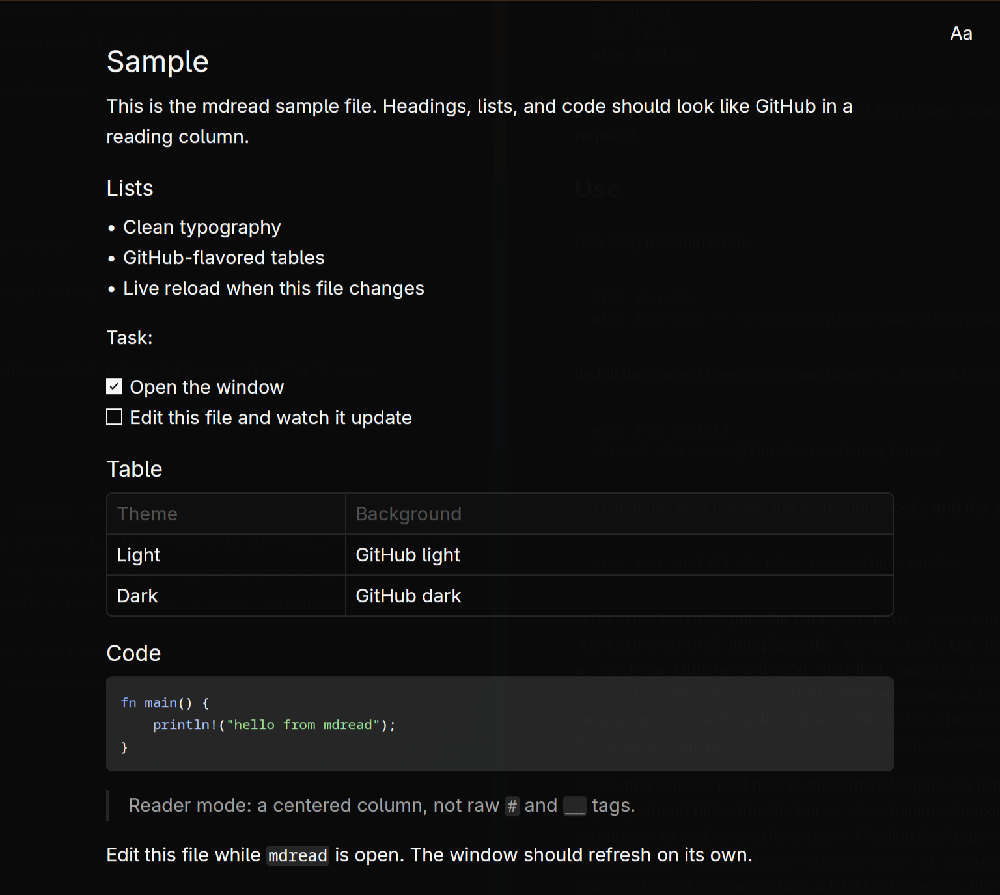

# mdread

A quiet desktop window for reading markdown. GitHub-flavored text, a font and theme you can change, and live reload when the file on disk changes. Leave it beside an editor or an agent and keep reading.



## Install

Linux x86_64 builds are on the [releases page](https://github.com/robsonperassoli/mdread/releases). The binary needs glibc 2.35 or newer (Ubuntu 22.04, Debian 12, Fedora, Arch, and Omarchy).

```bash
tar -xzf mdread-x86_64-linux.tar.gz
install -Dm755 mdread-x86_64-linux/mdread ~/.local/bin/mdread
```

`~/.local/bin` needs to be on your `PATH`.

mdread draws with Vulkan, so the machine needs a Vulkan loader (`libvulkan1` on Debian and Ubuntu) and a working GPU driver. The font list uses `fc-list` from fontconfig.

## Use

```bash
mdread notes.md
```

Run `mdread` with no path to pick a file. When the file changes on disk, the page re-renders. If you are already near the bottom, new content stays in view. YAML frontmatter stays hidden, so plan files stay readable.

The **Aa** button sets the theme, font, size, corner radius, and shadows. Choices are saved in `~/.config/mdread/config.toml`, and the window reloads that file when it changes.

```toml
theme = "Default Dark"
size = 18.0
radius = 6.0
radius_lg = 8.0
shadow = true
decorations = "auto" # auto | always | never
```

`auto` hides the title bar on tiling window managers (Hyprland, Sway, i3, niri) and keeps it on floating desktops. `always` and `never` override that. The same switch exists as `--decorations always|never`.

Omit `font` to use the system UI font. Set `theme = "custom"` to pick your own colors:

```toml
theme = "custom"

[custom]
mode = "dark"
background = "#0d1117"
foreground = "#f0f6fc"
muted = "#8b949e"
border = "#30363d"
primary = "#4493f8"
```

A release build returns to the shell once the window is up. Pass `--foreground` to keep the process attached.

## Omarchy

Omarchy can recolor mdread and match its font when you change the desktop theme. That setup is optional: [Omarchy integration](docs/omarchy.md).

## Development

Building from source, the mise tasks, and tests: [Development](docs/development.md).

## License

[MIT](LICENSE)
